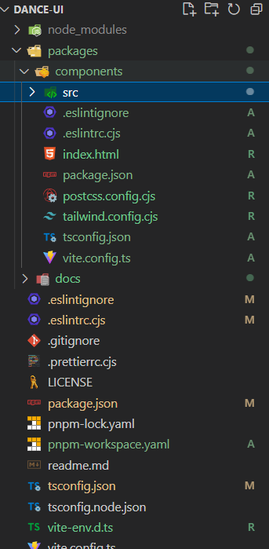
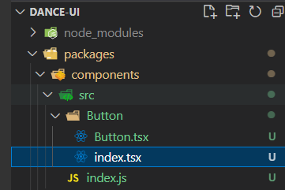
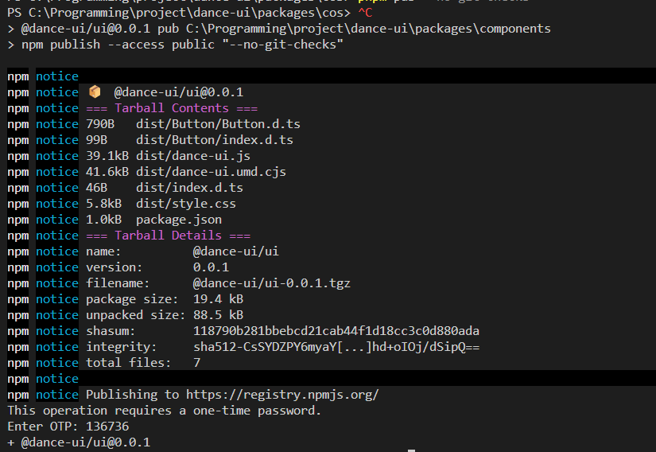
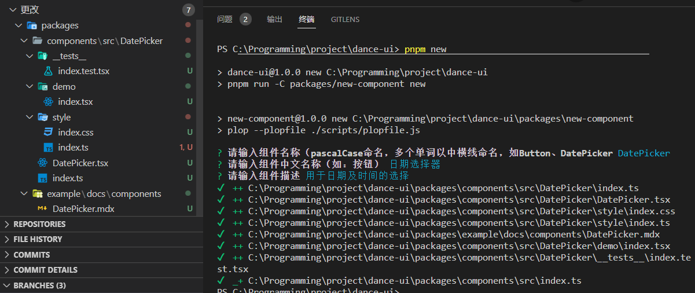

# 开发流程

## 环境搭建

参考文章：

- [【青训营】基于 pnpm 的 monorepo 包管理实践](https://juejin.cn/post/7053807488952434719)
- [pnpm + monorepo + changeset 实现多包管理和发布](https://juejin.cn/post/7181720787400228925)

### pnpm

使用 pnpm 进行包管理，首先当然全局安装 pnpm，并初始化项目，加入 vite

```bash
npm i -g pnpm
pnpm create vite
```

输入项目名称 dance-ui、选择 React、TypeScript + SWC，进入项目，下载依赖

```bash
pnpm i
```

`-w，--workspace-root`

在根目录执行命令，比如在根目录安装依赖，那么这个依赖可以在所有的 packages 中使用

`-F <package_name>，--filter <package_name>`

在过滤的指定包运行命令，我们可以通过下面的命令在指定的 package 安装依赖，这个依赖只可以在 package 中使用

### Husky

Husky +commitlint 可以帮助我们检查提交的 commit 信息，它强制约束我们的 commit 信息必须在开头附加指定类型，用于标示本次提交的大致意图。遵循 Angular 提交信息规范

```bash
pnpm add @commitlint/cli @commitlint/config-conventional commitlint husky -D
```

### Prettier + ESLint

首先安装 ESLint，交互式选择自己的需要，参考文章：[vue3+ts+vite 项目中使用 eslint+prettier+stylelint+husky 指南](https://juejin.cn/post/7118294114734440455)

```bash
pnpm add eslint -D
pnpm eslint --init
```

生成 `.eslintrc.cjs`文件如下：

```javascript
module.exports = {
  env: {
    browser: true,
    es2021: true,
  },
  extends: ['plugin:react/recommended', 'standard-with-typescript'],
  overrides: [],
  parserOptions: {
    ecmaVersion: 'latest',
    sourceType: 'module',
  },
  plugins: ['react'],
  rules: {},
}
```

在 package.json 文件中的 script 中添加 lint 命令

```json
{
  "scripts": {
    // eslint . 为指定lint当前项目中的文件
    // --ext 为指定lint哪些后缀的文件
    // --fix 开启自动修复
    "lint": "eslint . --ext .js,.ts,.jsx,.tsx --fix"
  }
}
```

新建 prettier 配置文件 `.prettierrc.js`，需注意的是引入 tailwind prettier 插件和 tailwindConfig 都是后边再加的。

```javascript
module.exports = {
  tabWidth: 2, // Tab = 2空格
  useTabs: false, // 不要用 Tab
  semi: false, // 句尾不要分号
  singleQuote: true, // 在jsx中使用单引号代替双引号
  quoteProps: 'as-needed', // 仅在必需时为对象的key添加引号
  jsxSingleQuote: false, // jsx中使用单引号
  trailingComma: 'all', // 多行时尽可能打印尾随逗号
  bracketSpacing: true, // 在对象前后添加空格 - eg: { foo: bar }
  jsxBracketSameLine: true, // 在jsx中把 '>' 是否折行
  endOfLine: 'lf', // 行尾序列 Linux LF
  embeddedLanguageFormatting: 'auto',
  printWidth: 128,
  // plugins: [require('prettier-plugin-tailwindcss')],
  // tailwindConfig: './tailwind.config.js',
}
```

使用 `eslint-config-prettier` + `eslint-plugin-prettier`解决 ESLint 和 prettier 冲突问题。

```bash
pnpm add eslint-config-prettier eslint-plugin-prettier -D
```

在  .eslintrc.json 中 extends 的最后添加一个配置

```javascript
{
    extends: [
    'plugin:react/recommended',
    'standard-with-typescript',
+    // 新增，必须放在最后面
+    'plugin:prettier/recommended'
  ],
}
```

再加个新的插件：[eslint-plugin-react-hooks](https://www.npmjs.com/package/eslint-plugin-react-hooks) 自动

### Tailwind & postcss

[官方安装教程](https://tailwindcss.com/docs/guides/vite)

首先安装 Tailwind CSS 和 postcss、autoprefixer
然后运行 tailwindcss init -p 生成 tailwind 配置文件

```bash
pnpm add -D tailwindcss postcss autoprefixer
npx tailwindcss init -p
```

在 tailwind.config.cjs 中配置文件路径

```javascript
/** @type {import('tailwindcss').Config} */
module.exports = {
  content: ['./index.html', './src/**/*.{js,ts,jsx,tsx}'],
  theme: {
    extend: {},
  },
  plugins: [],
}
```

将每个 Tailwind 层的 @tailwind 指令添加到您的 ./src/index.css 文件中。

```css
@tailwind base;
@tailwind components;
@tailwind utilities;
```

然后就可以愉快使用了~

### 改进 - monorepo - pnpm-workspace.yaml

[pnpm + monorepo + changeset 实现多包管理和发布](https://juejin.cn/post/7181720787400228925)

新建 `pnpm-workspace.yaml` 文件，定义工作空间的根目录，并能够使您从工作空间中包含 / 排除目录 。 默认情况下，包含所有子目录。

```yml
packages: # 所有在 packages/ 子目录下的 package
  - 'packages/**'
  # 不包括在 test 文件夹下的 package
  - '!**/test/**'
```

创建 packages 文件夹，创建 components 包，进入该目录并初始化

```bash
mkdir packages/components
cd
pnpm init
```

将生成的 package.json 的 name 改为@dance-ui/components，再将外层的脚本及 src 文件夹挪进来

```json
{
  "name": "@dance-ui/components",
  "version": "1.0.0",
  "description": "🌸 A simple and elegant component library.",
  "scripts": {
    "dev": "vite",
    "test": "echo \"Error: no test specified\" && exit 1",
    "build": "tsc && vite build",
    "preview": "vite preview",
    "lint": "eslint . --ext .js,.ts,.jsx,.tsx --fix"
  },
  "keywords": [],
  "author": "",
  "license": "ISC"
}
```

将 tsconfig.json 中的 include 改为

```json
{
  "include": ["packages/**/*.ts", "packages/**/*.d.ts", "packages/**/*.tsx"]
}
```

将根目录下的脚本改为执行该包下的 [`-C <path>, --dir <path>`](https://www.pnpm.cn/pnpm-cli#-c-path---dir-path) 表示将 `<path>` 设置为 `pnpm` 的运行目录，而不是当前目录

```bash
pnpm run -C packages/components dev
pnpm run -C packages/components lint
```

现在根目录的 package.json 如下

```json
{
  "name": "dance-ui",
  "private": true,
  "version": "0.0.0",
  "description": "🌸 A simple and elegant component library.",
  "repository": "https://github.com/dancing-team/dance-ui",
  "type": "module",
  "workspaces": ["packages/*"],
  "scripts": {
    "dev": "pnpm run -C packages/components dev",
    "lint": "pnpm run -C packages/components lint"
  },
  "dependencies": {
    "react": "^18.2.0",
    "react-dom": "^18.2.0"
    // ...
  },
  "devDependencies": {
    "@types/react": "^18.0.26",
    "@types/react-dom": "^18.0.9"
    // ...
  }
}
```

项目的目录结构如下：



### 打包配置

写一个最基础的 button 组件，将其导出，改造下目录结构：



利用 vite 的 [库模式](https://cn.vitejs.dev/guide/build.html#library-mode)进行打包

- 参考文章 [使用 Vite 和 TypeScript 带你从零打造一个属于自己的 Vue3 组件库](https://www.51cto.com/article/715946.html)、[使用 Vite 从零开始构建 React 组件库](https://www.cnblogs.com/wisewrong/p/16550439.html)

首先将 vite.config.ts 配置如下

```typescript
import { defineConfig } from 'vite'
import react from '@vitejs/plugin-react-swc'
import { resolve } from 'path'
import dts from 'vite-plugin-dts'

// https://vitejs.dev/config/
export default defineConfig({
  plugins: [
    react(),
    dts({
      //指定使用的tsconfig.json
      tsConfigFilePath: './tsconfig.json',
    }),
    //因为这个插件默认打包到es下，我们想让lib目录下也生成声明文件需要再配置一个
    // dts({
    //   outputDir: 'lib',
    //   tsConfigFilePath: './tsconfig.json',
    // }),
  ],
  build: {
    target: 'modules',
    //打包文件目录
    outDir: 'dist',
    //压缩
    minify: false,
    // 内联 css
    // cssCodeSplit: true,
    rollupOptions: {
      // 确保外部化处理那些你不想打包进库的依赖
      external: ['react', 'react-dom'],
      output: {
        // 在 UMD 构建模式下为这些外部化的依赖提供一个全局变量
        globals: {
          react: 'react',
          'react-dom': 'react-dom',
        },
      },
    },
    lib: {
      entry: 'src/index.ts',
      name: 'dance-ui',
      fileName: 'dance-ui',
    },
  },
})
```

tailwind 的打包前，需要先把 tailwind 自己的预设重置关掉：`tailwind.config.js` 中增加

```dotnetcli
module.exports = {
+  corePlugins: {
+    preflight: false,
+  }
}
```

### 文档站环境搭建

使用 [Docusaurus](https://docusaurus.io/docs) 搭建文件站

```bash
npx create-docusaurus@latest example classic --typescript
```

### npm 发包

在 packages/components/package.json 中加入发布脚本 pub， 利用 npm publish 进行发布

然后报错，怎么回事呢。

```json
{
  "scripts": {
    "pub": "npm publish --access public"
  }
}
```

本地发包需要注册登录 npm：`npm adduser` 输入你的一些信息


> ps: 需要将镜像源切到 npm 官方，可以使用 nrm 管理

查看当前 npm 登录人 npm whoami


发布成功，注意我这里使用的两步验证发的



### preinstall & changesets

preinstall 只允许 pnpm

当在项目中使用 pnpm 时，如果不希望用户使用 yarn 或者 npm 安装依赖，可以将下面的这个 preinstall 脚本添加到工程根目录下的 package.json 中：

```json
{
  "scripts": {
    "preinstall": "npx only-allow pnpm"
  }
}
```

[preinstall](https://docs.npmjs.com/cli/v6/using-npm/scripts#pre--post-scripts) 脚本会在 install 之前执行，现在，只要有人运行 `npm install` 或 `yarn install`，就会调用 [only-allow](https://github.com/pnpm/only-allow) 去限制只允许使用 pnpm 安装依赖。

#### 使用 changeset version 提交版本修改

<<<<<<< Updated upstream
changesets 使用：[使用 Changesets 自动版本管理](https://github.com/ChelesteWang/learn-monorepo#%E4%BD%BF%E7%94%A8-changesets-%E8%87%AA%E5%8A%A8%E7%89%88%E6%9C%AC%E7%AE%A1%E7%90%86)

- [Changesets: 流行的 monorepo 场景发包工具](https://zhuanlan.zhihu.com/p/427588430)
- # 根目录下安装 @changesets/cli 并初始化
- [部署到 Vercel](https://docusaurus.io/zh-CN/docs/deployment#deploying-to-vercel)
- [Monorepos - Vercel](https://vercel.com/docs/concepts/monorepos)
  > > > > > > > Stashed changes

```bash
pnpm install @changesets/cli -w -D  && npx changeset init
```

执行 `npx changeset add` 选择本次 changeset 需要发布的包

在根目录的 package.json 中新增 1 个 script 方便后续使用

```json
    "version": "changeset version"
```

版本号一般有三个部分，以.隔开，就像 X.Y.Z，其中

X：主版本号，不兼容的大改动，major
Y：次版本号，功能性的改动，minor
Z：修订版本号，问题修复，patch
每个部分为整数（>=0），按照递增的规则改变。

`npx changeset version`


执行后之前生成的 stale-shrimps-design.md 会被消费掉并修改对应的子包下的 package.json 并生成 CHANGELOG.md

自动化发布：[实现自动化发布](https://juejin.cn/post/7140639347937640479#heading-7)

NPM_TOKEN 的获取

在 npm 官网 生成 Npm 私钥，注意选择 Automation


### 编写 new 脚本 新建组件框架

- [React 组件库搭建指南（五）：标准化发布流程](https://github.com/worldzhao/blog/issues/7)

思路如下：

- 创建组件模板，预留动态信息插槽（组件名称，组件描述等等）；
- 基于 inquirer.js 询问动态信息；
- 将信息插入模板，渲染至 components 文件夹下；
- 向 components/index.ts 插入导出语句。

新建 add-component 子包 安装 plop

```bash
mkdir packages/add-component
cd  packages/add-component
pnpm init
pnpm add -D plop
```

新增 scripts 和 templates 文件夹用于存放脚本和模板

```bash
mkdir scripts && mkdir templates
cd scripts
```

新增 new 脚本

```json
// packages/add-component/package.json
"scripts": {
+ "new": "plop --plopfile ./scripts/plopfile.ts",
},
```

接下来就是编写配置文件和组件模板了，见

- 配置文件： [packages/new-component/scripts/plopfile.js](https://github.com/dancing-team/dance-ui/tree/main/packages/new-component/scripts/plopfile.js)
- 组件模板： [packages/new-component/templates](https://github.com/dancing-team/dance-ui/tree/main/packages/new-component/templates)


